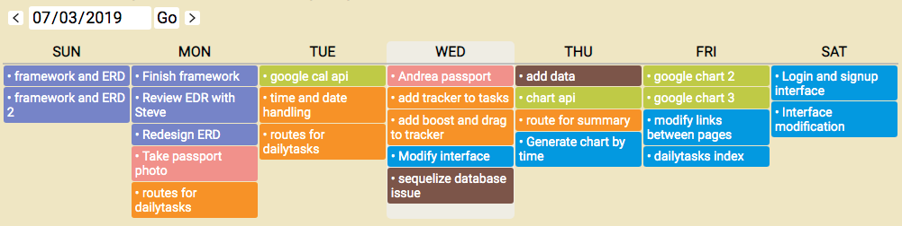

# MyE&T
My E&T (My Effort and Time, [Live App](https://my-e-and-t.herokuapp.com/)) is designed to be an application integrated with personal planner, project tracker and effort and time summarizer. It will help users planning and tracking their short-term and long-term projects and goals, while tracking the outcome of users time usage and effort to provide statistic insides. The insides could further help users optmize their time and effort and boost performance.

### Table of Content
* [Design](#Design)
* [Developmnet](#Development)
* [Conclusion](#Conclusion)

**Tech:** Javascript, Node/Express, ejs, SQL/Postgres/Sequeize, Google API (OAuth), HTML, CSS.

**Release Notes**

* Alpha version: (this repo), released July., 2019.
* Beta version : scheduled Nov., 2019.
* Verision 1.0: scheduled Feb., 2020.
* Mobile version: scheduled late 2020.

For features in each version please check [Features](#Features) section.

**App Preivew**

| Login| Task Tracker |
|:---:|:---:|
| |  |

| Task Statistis |
|:---:|
| |

## Design

My E&T shares the idea with hobonichi and spiraldex with which people hand write their plan and record their status (good and bad things) during their activities, and further optimize their plan, method and habit based on their self feedback. However, handing writing could be quite a work. Moreover, the most valueable feedback statistic need even more work to pull it out.

My E&T aims to provide a convenient way to track users' daily acitivity and add records. It is also automatic generate useful statistics to help users to spend their effort and time more effeciently:
* Statistics on users most efficient and interrupted time during a period
* Statistics on users' time useage on different activity (work, study, exercise, entertainning...)
* Time and progress statistics on different projects
* Most common interruption and low performance causes 
* and so on.....

According to the results, users could modify their schedule, habit and method to have better outcome form their effort and time so that speed up on their rail to the goal while having more time to enjoy the life.

### Features
**Alpha version Features**
* Authentication functions (login and signup)
* Weekly planner + Daily task tracker
  * show tasks for the whole week and tasks vs time at selected date
  * create daily task
  * got to a date by click weekday or select date
  * show task tracker by click task in either week tasks panel and day tasks panel
  * in task tracker:
    * record task effieciency
    * add and remove drag and boost events in the task
    * add notes for tasks
* Summaries page - statistic for tasks
  * time ratio and hours on different type of tasks
  * average efficiency, boosts and drags during different hours of day

**Coming Features**
* Beta version (expcted Nov. 2019)
  * optimize ERD.
  * add daily and week habit tracker
  * 1 month, 1 year, 10 years planning page 
  * adding and optimize interactive component with React.js

* Version 1.0 (expected Feb. 2020)
    * summaries by type, drag and boost summaries function
    * add dragging effect to dailytasks div
    * link and sync with google calendar
    * more customize options for calendar

* Mobile version (planned 2020)

To implement the featuers, besides login/signup pages, full app will include 5 pages (10 years, 1 year, 1 month, 1 week, summary).

After self and peer review on design, for the 1-week aphla version develpment, ERD and pages are decided as following. The ERD is not optimized yet. The project and subproject can possibly merged with dailytasks in to a tasks table. For alpha version focusing on week+daily tracker and summaries feathers, the ERD optimization is planned in beta version.

Login page | task eidt page
|:---:|:---:|
 | 
   
| week, daily tracker planner | summary | 
|:---:|:---:|
|  |  |

Current entity relationship diagram (ERD)


## Development

### Backend
The backend is constructed with a Node/Express server and SQL (postgres) database. Node modules:
* Sequelize: for database communication
* ejs: for page rendering
* express-session and bcrypt: for passwrod encrypt and authentication
* moment: for date and time

**Routes**

5 router files are created to better manage routes. 4 of them are protected by the middleware isLoggedIn which requires user to login before access the data in database and secure the user data.

*Router Files*
```javascript

//create and login user
app.use('/auth', require('./controllers/auth')); 
// CRUD routes for dailytasks
app.use('/dailyTasks', isLoggedIn, require('./controllers/dailyTasks.js')); 
// CRUD routes for boots (boost is an attribute of task tracker)
app.use('/boosts', isLoggedIn, require('./controllers/boosts.js'));
// CRUD routes for boots (boost is an attribute of task tracker)
app.use('/drags', isLoggedIn, require('./controllers/drags.js'));
// get info for summary page (show statistics for tasks)
app.use('/summaries', isLoggedIn, require('./controllers/summaries.js'));

```

*IsLoggedIn middleware*
```javascript

//*make sure user is logged in to access certain page
module.exports = function(req, res, next) {
  if (!req.user) {
    req.flash('error', 'You must be logged in to access that page');
    res.redirect('/auth/login');
  } else {
    next();
  }
};

```

**Restful Routes for Dailytasks**

| Routes | Methods | Notes |
|:------:|:-------:|:-----:|
| /dailyTasks | POST | add a new task to user |
| /dailyTasks/:taskId | GET | get a task and all tasks at the same week for user |
| /dailyTasks/:taskId | PUT | update the task for user |
| /dailyTasks/:taskId | DELETE | remove the task from user |
| /drags | POST | add a drag to a task |
| /boosts | POST | add a boost to a task |

**Other Routes for Dailytasks**
Due to the limitation of ejs. in order to implement some design, forms could not be used. As results some non RESTful routes are used. This will be modify in Beta version.
| Routes | Methods | Notes |
|:------:|:-------:|:-----:|
| /dailyTasks/:taskId/addnotes | GET | add task tracker notes to  a project |
| /dailyTasks/:taskId/efficiency | GET | change efficiency rank of a task |
| /drags/remove | GET | remove a drag tag from a task |
| /boosts/remove | GET | remove a boost tag from a task |

### Frontend

For frontend:
* Weekly Tasks and daily tasks view are generated with Javascripts
* Charts are generated with google chart API
* Others: expresss-ejs

**Weekly Tasks View**


To create a weekly, weekTasks from server were sorted in to array by their weekdays. Then the arrange is used to create the divs for page.
```javascript
var weekTasks // task data from backend
//* DOM elements =======================================
var weektasksEl = document.getElementById('weektasks'); //container for week tasks
var weekdaytasksElArr = []; //elements array for task on each day

//* create week tasks div========================================
// ** create div for each day
for (let i=0; i <=6; i++) {
  weekdaytasksElArr[i] =document.createElement('div');
  let link = document.createElement('a');
  let temp = moment(weekStart);
  link.classList.add('tablink');
  link.href = "/dailytasks/date?date=" + temp.add(i, 'day').format('YYYY-MM-DD');
  console.log(weekStart.format('YYYY-MM-DD'));
  link.textContent = moment(i, 'd').format('ddd').toUpperCase();
  weekdaytasksElArr[i].appendChild(link);
  if (i == currentDate.format('d')) weekdaytasksElArr[i].id = 'currentdate';
}

// ** append all tasks on corresponding day
weekTasks.forEach(function(task) {
  let taskEl = document.createElement('a');
  taskEl.href = '/dailytasks/' + task.id;
  taskEl.textContent = "• " + task.summary;
  taskEl.classList.add(task.type);
  taskEl.classList.add('tabtask')
  weekdaytasksElArr[moment(task.start).format('d')].appendChild(taskEl);
})

// ** add element into page
for (let element of weekdaytasksElArr) {
  weektasksEl.appendChild(element);
}

```

**Daily Tasks View**


To create a day tasks view, width and postion of task div must be controlled depending on the start and end time of tasks. Absolute position, and percentage left and width was used for each task div. The value was calculated:
```javascript
var tasks //tasks for the selected date from server
//* DOM elements =======================================
var dayTasksListEl = document.getElementById('daytaskslist');

//* create day tasks div========================================
tasks.forEach(function(task) {
  let taskEl = document.createElement('div');
  let linkEl = document.createElement('a');
  if (typeof selectId != 'undefined' && task.id == selectId) {
      console.log('select taskid' + selectId + ' is ', task.id);
      taskEl.id = 'selectTask';
      let contentEl = document.createElement('div');
      contentEl.textContent = task.summary + ' ' +`(${task.type})`
      taskEl.appendChild(contentEl);
  } else {
    taskEl.textContent = task.summary + ' ' +`(${task.type})`;
  }
  linkEl.classList.add('daytask');
  linkEl.href = '/dailytasks/' + task.id;
  taskEl.classList.add(task.type);
  linkEl.appendChild(taskEl);
  
  //** position the div
  let start = moment(task.start);
  let end = moment(task.end);
  let startpos = moment(start.format('H:mm'), 'H:mm').diff(moment('7:30', 'H:mm;'), 'minutes');
  let width = moment(end).diff(start, 'minutes');
  // console.log(start.format('H:mm') + "'s start pos is " + startpos);
  // length for 10 hour (600) is 100%, 1 minute = 1/6% width on screen 
  startpos = startpos/6 + '%';
  width = width/6 + '%';
  // console.log(startpos, width);

  linkEl.style.left = startpos;
  linkEl.style.width = width;

  dayTasksListEl.appendChild(linkEl);
})

```

## Conclusion

For the alpha version, this app presented the core concept of MyE&T:
* task tracker for user's tasks with efficiency, drags and boost record.
* provide statics for user's effort and time for better planning and working in future.

However, there are still missing features as mention in features section. Due to the limitation of ejs, some of user interaction is still not satisfactory:
* page refreshing for almost every mouse activity (add drags, boost, change efficiency,....)
* hard to modify task time
These issues will be tracked in beta version with React.


## References
* **[Google Chart API](https://developers.google.com/chart/)**: for chart generation.
* **[Stack Overflow](https://stackoverflow.com/)**: for quesionts and errors.
* **[W3School](https://www.w3schools.com/)**: for CSS, HTML and Javascript documents.


