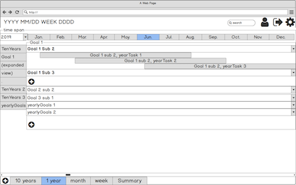

# MyE&T
My E&T (My Effort and Time) is designed to be an application integrated with personal planner, project tracker and effort and time summarizer. It will help users planning and tracking their short-term and long-term projects and goals, while tracking the outcome of users time usage and effort to provide statistic insides. The insides could further help users optmize their time and effort and boost performance.

## Introduction
My E&T shares the idea with hobonichi and spiraldex with which people hand write their plan and record their status (good and bad things) during their activities, and further optimize their plan, method and habit based on their self feedback. However, handing writing could be quite a work. Moreover, the most valueable feedback statistic need even more work to pull it out.

My E&T aims to provide a convenient way to track users' daily acitivity and add records. It is also automatic generate useful statistics to help users to spend their effort and time more effeciently:
* Statistics on users most efficient and interrupted time during a period
* Statistics on users' time useage on different activity (work, study, exercise, entertainning...)
* Time and progress statistics on different projects
* Most common interruption and low performance causes 
* and so on.....

According to the results, users could modify their schedule, habit and method to have better outcome form their effort and time so that speed up on their rail to the goal while having more time to enjoy the life.

## Design & Planning
Besides login/signup pages, 5 pages (10 years, 1 year, 1 month, 1 week, summary) are designed.

Login page | task eidt page
--- | ---
 | 

10 years planner | 1 year planner
--- | ---
 | 

month planner | week, daily tracker planner
--- | ---
 | 
   
summary | 
--- | ---
 |

Current entity relationship diagram (ERD)

### Features
**Alpha version Features**
* Authentication functions (login and signup)
* Weekly planner + Daily task tracker
  * show tasks for the whole week and tasks vs time at selected date
  * create daily task
  * got to a date by click weekday or select date
  * show task tracker by click task in either week tasks panel and day tasks panel
  * in task tracker:
    * record task effieciency
    * add and remove drag and boost events in the task
    * add notes for tasks
* Summaries page - statistic for tasks
  * time ratio and hours on different type of tasks
  * average efficiency, boosts and drags during different hours of day

**Coming Features**
* Beta version
  * adding and optimize interactive component with React.js
  *  

## Development
1. use the same data set for all the ejs in views.
2. 

### Planning
* Initial Work (1~2 days)
  * framework 
  * google calendar API and data structure (ERD)

* Basic function development I (day 2)
  * basic framework for 5 years, year, month, week tasks ( ~4 hours)
    * new.ejs or js left sidepop in show.ejs: [ year, month], week, 
    * show.ejs: each for all.
    * edit.ejs: same to new.ejs
  * Recheck Data structure (ERD) (~1 hour)
  * Basic CRUD for different types of tasks (~3 hours)
    * Level 1 tasks CRUD, frame rendition and css class (year)
    * Level 2 tasks CRUD, frame rendition (as level 1 sub) and css class. (sub in year, main in month)
    * Level 3 tasks CRUD, frame rendition                                 (sub in month, main in week)

* Review and Interface Development (day 3)
  * Peer review on routes and ERD.
  * User Interface development

* Reactive Function and google chart API (day 4)

* Statistic Report Development (day 5)
  

