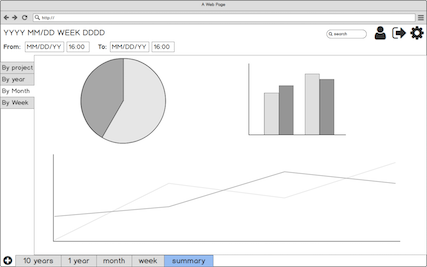

# MyE&T
My E&T (My Effort and Time, [Live App](https://mysterious-ocean-78106.herokuapp.com/auth/login)) is designed to be an application integrated with personal planner, project tracker and effort and time summarizer. It will help users planning and tracking their short-term and long-term projects and goals, while tracking the outcome of users time usage and effort to provide statistic insides. The insides could further help users optmize their time and effort and boost performance.

**Tech:** Javascript, Node/Express, ejs, SQL/Postgres/Sequeize, Google API (OAuth), HTML, CSS.

**App Preivew**

| Login| Task Tracker |
|:---:|:---:|
| |  |

| Task Statistis |
|:---:|
| |

## Introduction
My E&T shares the idea with hobonichi and spiraldex with which people hand write their plan and record their status (good and bad things) during their activities, and further optimize their plan, method and habit based on their self feedback. However, handing writing could be quite a work. Moreover, the most valueable feedback statistic need even more work to pull it out.

My E&T aims to provide a convenient way to track users' daily acitivity and add records. It is also automatic generate useful statistics to help users to spend their effort and time more effeciently:
* Statistics on users most efficient and interrupted time during a period
* Statistics on users' time useage on different activity (work, study, exercise, entertainning...)
* Time and progress statistics on different projects
* Most common interruption and low performance causes 
* and so on.....

According to the results, users could modify their schedule, habit and method to have better outcome form their effort and time so that speed up on their rail to the goal while having more time to enjoy the life.

## Design & Planning
Besides login/signup pages, full app will include 5 pages (10 years, 1 year, 1 month, 1 week, summary).

Login page | task eidt page
|:---:|:---:|
 | 

10 years planner | 1 year planner
|:---:|:---:|
 | 

month planner | week, daily tracker planner
|:---:|:---:|
 | 
   
summary | 
|:---:|:---:|
 |

After self and peer review on design, for the 1-week aphla version develpment, ERD and included features are as following. The ERD is not optimized yet. The project and subproject can possibly merged with dailytasks in to a tasks table. For alpha version focusing on week+daily tracker and summaries feathers, the ERD optimization is planned in beta version.

Current entity relationship diagram (ERD)

### Features
**Alpha version Features**
* Authentication functions (login and signup)
* Weekly planner + Daily task tracker
  * show tasks for the whole week and tasks vs time at selected date
  * create daily task
  * got to a date by click weekday or select date
  * show task tracker by click task in either week tasks panel and day tasks panel
  * in task tracker:
    * record task effieciency
    * add and remove drag and boost events in the task
    * add notes for tasks
* Summaries page - statistic for tasks
  * time ratio and hours on different type of tasks
  * average efficiency, boosts and drags during different hours of day

**Coming Features**
* Beta version (expcted Sep. 2019)
  * optimize ERD.
  * add daily and week habit tracker
  * 1 month, 1 year, 10 years planning page 
  * adding and optimize interactive component with React.js

* Version 1.0 (expected Nov. 2019)
    * summaries by type, drag and boost summaries function
    * add dragging effect to dailytasks div
    * link and sync with google calendar
    * more customize options for calendar

* Mobile version (planned 2020)

### Planning
* Basic backend and frontend Setup (day 1 - 2):
    * create routes (CRUD) and ejs for users and dailystasks
    * setup database in postgres with Sequelize
    * testing creating and updating users and tasks in routes
    * basic layout (css) 

* Date and time handling, and Google Chart API (day 2)
    * study how to handle time (difference, format...) with moment and Sequelize
    * add date selector on page
    * study how to generate chart with Google Chart API

* Backend and frontend setup for task tracker (efficiency, boost, drag and notes) (day 3)
    * database, routes and ejs setup
    * basic layout (css)
    * interactive function

* Generate chart in summaries page with Google Chart API (day 4)

* User interface modification (css) (day 5)

* Flexible schedule (day 6-7)
    * flex time for delayed work or debug
    * more modification on interface

## Development
overview on frame work and features

### Database
SQL, sequelize, postgres, models

### Server
Node/Express

### Authentication
session, bcrypt

### Frontend
ejs, javscript generated page, google chart API

**Weekly Tasks View**
add tasks to right day with right order

**Daily Tasks View**
*Task Positioning*
position the task in the daily view at right time and with right length

*Task Tracking Features*
add efficiency, drag, boost and notes

**Generate Statistics**
OAuth
how to transform data to get statistic by google chart API

## Conclusion

## References

